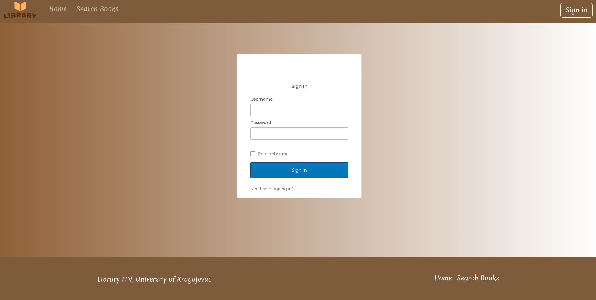
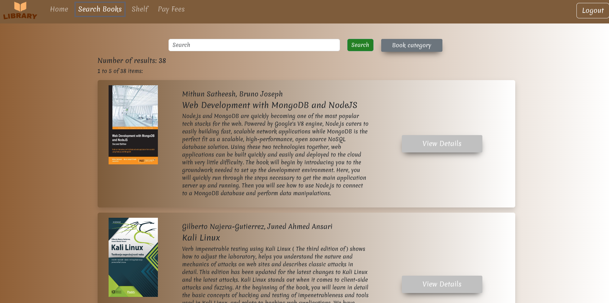

# Full-Stack Library Management Application

Library Management Application is a full-stack application that simulates library operations integrating popular technologies such as SpringBoot, REST APIs, MySQL database, and React for the user interface.
The application emphasizes security using JWT (JSON Web Tokens), OAuth2, and OpenID Connect, along with functionalities for user login/logout and role management.

## Functionalities

### User

- **Login and Logout**: Users can log in and log out.
- **Book Rental**: Rent books from the library.
- **Book Rating**: Rate rented books.
- **Leave Comments on Books**: Add comments to books.
- **View Rented Books**: See currently rented books.
- **View Rental History**: Check the history of rented books.
- **Late Payment**: Pay a fine for late returns.
- **Ask Questions to Administrator**: Direct questions to the administrator.

### Administrator

- **Manage Book Inventory**: Change available book quantities.
- **Add New Books**: Add new books to the library.
- **Respond to User Questions**: Answer user queries.

## The appearance of the Home page

  

## The appearance of the login page

  

## The appearance of the Search page

  

## Technologies

- **Backend**: SpringBoot, Java, Maven, MySQL
- **Frontend**: React, TypeScript
- **Security**: JSON Web Tokens (JWT), OAuth2, OpenID Connect

